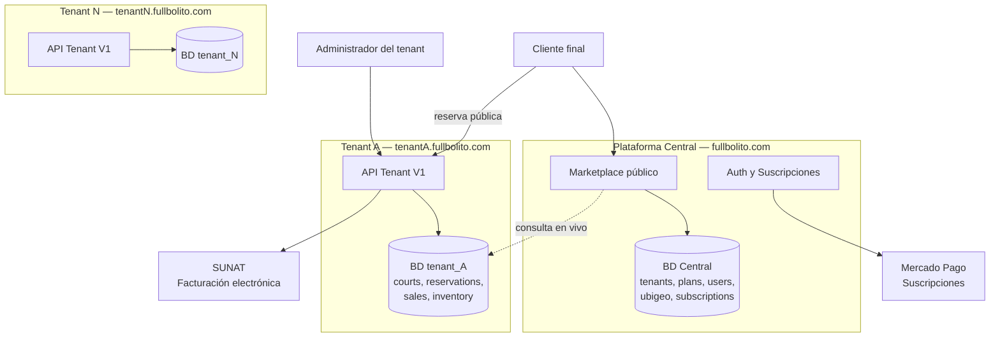
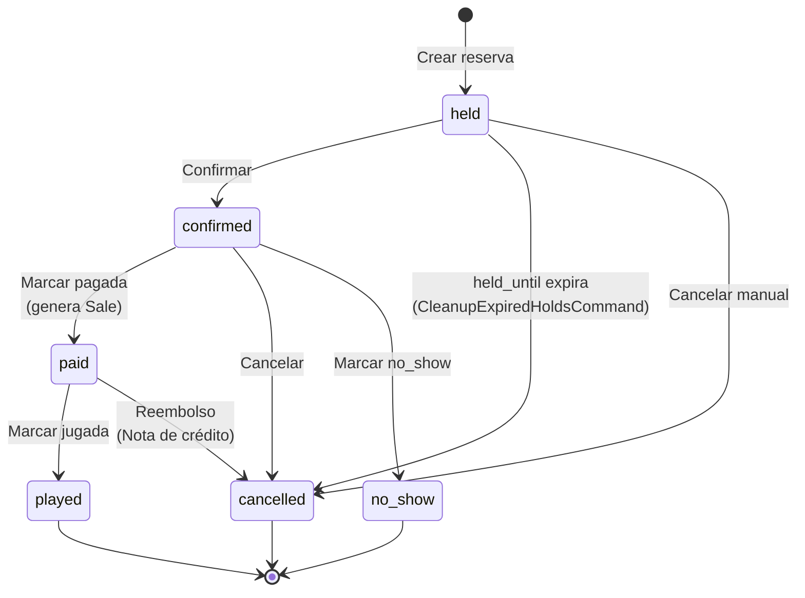

# MEMORIA TÉCNICA — FULLBOLITO

### Plataforma SaaS multi-tenant para la gestión y comercialización de espacios deportivos

---

**Trabajo de Maestría**
**Autor:** _[completar]_
**Tutor/Director:** _[completar]_
**Institución:** _[completar]_
**Fecha:** Junio de 2026
**Repositorio:** `fullbolito` (rama `pancito`)

---

## Tabla de contenidos

1. [Resumen](#resumen)
2. [Capítulo 1 — Introducción](#capítulo-1--introducción)
3. [Capítulo 2 — Marco teórico y conceptual](#capítulo-2--marco-teórico-y-conceptual)
4. [Capítulo 3 — Arquitectura del sistema](#capítulo-3--arquitectura-del-sistema)
5. [Capítulo 4 — Stack tecnológico](#capítulo-4--stack-tecnológico)
6. [Capítulo 5 — Modelo de datos del dominio](#capítulo-5--modelo-de-datos-del-dominio)
7. [Capítulo 6 — Módulos funcionales implementados](#capítulo-6--módulos-funcionales-implementados)
8. [Capítulo 7 — Decisiones de diseño y patrones](#capítulo-7--decisiones-de-diseño-y-patrones)
9. [Capítulo 8 — Modelo de negocio SaaS](#capítulo-8--modelo-de-negocio-saas)
10. [Capítulo 9 — Conclusiones y trabajo futuro](#capítulo-9--conclusiones-y-trabajo-futuro)
11. [Anexos](#anexos)

---

## Resumen

**Fullbolito** es una plataforma **Software-as-a-Service (SaaS) multi-tenant** orientada al sector de los espacios deportivos de alquiler (canchas de fútbol, fútsal, pádel, vóley, entre otros). El sistema se estructura en dos capas operativas claramente diferenciadas: una **plataforma central pública** que actúa como marketplace y permite al cliente final descubrir y reservar canchas en distintas sedes; y un **panel administrativo por tenant** —es decir, por cada complejo deportivo suscrito al servicio— que provee gestión completa de canchas, horarios, reservas, ventas, facturación electrónica conforme a la normativa peruana (SUNAT), inventario, punto de venta, programa de lealtad y un constructor de sitios web propio.

Desde el punto de vista técnico, la solución se construye sobre **Laravel 12** y **PHP 8.3** en el backend, con aislamiento **base-de-datos-por-tenant** mediante el paquete `stancl/tenancy`, autenticación basada en tokens **Laravel Sanctum**, control de acceso por roles y permisos con `spatie/laravel-permission`, facturación recurrente mediante la **API de Suscripciones de Mercado Pago** y emisión de comprobantes electrónicos con `greenter/lite`. El frontend está implementado como dos **aplicaciones Vue 3** independientes (central y tenant), escritas en **TypeScript** sobre **Vite 6**, con `vue-router`, `Pinia` como gestor de estado, `Tailwind CSS 4` para estilos y `Radix Vue`/`reka-ui` como capa de componentes headless.

El aporte del presente trabajo es triple: (i) plantea una arquitectura SaaS verticalizable a partir de un SaaS base genérico; (ii) integra un dominio operacional especializado (reservas con holds temporales, horarios dinámicos, numeración fiscal) sin sacrificar los módulos transversales del SaaS base; y (iii) demuestra el cumplimiento de requisitos regulatorios locales (facturación electrónica SUNAT) dentro del modelo multi-tenant.

**Palabras clave:** SaaS, multi-tenancy, Laravel, Vue.js, reservas, marketplace, facturación electrónica, SUNAT.

---

## Capítulo 1 — Introducción

### 1.1 Contexto y motivación

El alquiler de espacios deportivos (canchas de fútbol 7, fútsal, pádel, vóley, básquet, entre otros) constituye en Perú un sector con alta demanda urbana y, simultáneamente, una baja madurez digital. La inmensa mayoría de complejos deportivos opera mediante reservas telefónicas, mensajería instantánea o agendas en papel, lo que genera tres problemas operativos recurrentes: **doble reserva** (overbooking) sobre un mismo slot horario, **pérdida de horas valle** por falta de visibilidad pública del catálogo, y **gestión administrativa fragmentada** —el cobro, la facturación electrónica obligatoria por SUNAT y el seguimiento de clientes recurrentes se hacen en herramientas distintas y desconectadas.

Desde la perspectiva del cliente final, la reserva de una cancha requiere conocer previamente la existencia del complejo, llamar por teléfono en horario comercial y confiar en la palabra del recepcionista sobre la disponibilidad. No existe un agregador equivalente a las plataformas de reservas hoteleras o de restaurantes para este vertical.

### 1.2 Problema

Se identifican cuatro problemas centrales que motivan el desarrollo de **Fullbolito**:

1. **Ausencia de un canal digital unificado** para que el cliente final descubra canchas deportivas por ubicación geográfica, deporte y disponibilidad horaria.
2. **Ausencia de un sistema de gestión integral** para el operador del complejo deportivo que cubra reservas, ventas, facturación electrónica, inventario de productos complementarios (bebidas, alquiler de balones) y fidelización.
3. **Doble reserva y holds no controlados**: en sistemas manuales, mantener un slot bloqueado para un cliente que está decidiendo el pago genera pérdidas o conflictos.
4. **Necesidad de cumplimiento fiscal**: la emisión de comprobantes electrónicos (boletas, facturas, notas de crédito) ante SUNAT es obligatoria para todo negocio formal en Perú y requiere integración técnica no trivial.

### 1.3 Objetivos

**Objetivo general.** Diseñar e implementar una plataforma SaaS multi-tenant que (i) permita al cliente final reservar canchas deportivas a través de un marketplace público y (ii) provea al operador un panel administrativo integral para la gestión de su complejo.

**Objetivos específicos.**

- Implementar una arquitectura multi-tenant con aislamiento de datos por base de datos.
- Diseñar un modelo de reservas con ciclo de vida explícito (hold, confirmada, pagada, jugada, cancelada, no presentada) que prevenga el overbooking.
- Integrar pasarela de pagos para suscripciones (Mercado Pago) y emisión de comprobantes electrónicos para ventas (SUNAT-Greenter).
- Construir un marketplace público que agregue las canchas de todos los tenants suscritos y soporte búsqueda geográfica jerárquica (departamento → provincia → distrito).
- Modularizar el sistema en _features_ activables mediante el plan de suscripción del tenant (módulos núcleo vs. _addons_ de pago).
- Cubrir los módulos transversales heredables del SaaS base: ventas, compras, inventario, POS, lealtad y constructor de sitios.

### 1.4 Alcance y limitaciones

El presente trabajo cubre el **diseño y la implementación** de la plataforma en su versión inicial. Quedan explícitamente fuera de alcance —al momento de redacción— los siguientes aspectos:

- Aplicación móvil nativa (iOS / Android).
- Pasarela de pago para el cliente final dentro del marketplace público (la primera versión asume cobro presencial al llegar al complejo o cobro fuera de banda).
- Internacionalización del marketplace (la versión inicial opera en español y soles peruanos).
- Caché agregada del marketplace central (la consulta v1 itera sobre las BDs de los tenants en vivo; está previsto migrar a un índice centralizado cuando se superen los ~50 tenants activos).
- Emisión a SUNAT en producción end-to-end con todos los tipos de comprobante (la base técnica está implementada con `greenter/lite` y se han generado XML firmados; el envío a los servicios de SUNAT productivos depende de la habilitación de credenciales por tenant).

---

## Capítulo 2 — Marco teórico y conceptual

### 2.1 Arquitectura SaaS multi-tenant

Un sistema **multi-tenant** sirve a múltiples clientes (_tenants_) desde una sola instalación de software, manteniendo aislamiento de datos entre ellos. Existen tres modelos clásicos de aislamiento:

| Modelo | Aislamiento | Coste por tenant | Migraciones | Riesgo de fuga de datos |
|---|---|---|---|---|
| Database-per-tenant | Alto | Alto | Por tenant | Muy bajo |
| Schema-per-tenant | Medio | Medio | Por schema | Bajo |
| Discriminator column | Bajo | Bajo | Único | Alto (errores de query) |

Fullbolito adopta el modelo **database-per-tenant**: cada complejo deportivo dispone de su propia base de datos independiente. Esta decisión privilegia el aislamiento (clave para datos comerciales sensibles, secuencias fiscales y trazabilidad SUNAT) sobre la eficiencia de recursos, asumiendo que el número de tenants en horizonte cercano se contará en decenas o centenas (no miles).

### 2.2 Patrón Marketplace + Panel administrativo

El sistema combina dos patrones de UX y dos audiencias de usuario:

- **Marketplace público (central).** Página web accesible sin autenticación, que agrega el catálogo de canchas de todos los tenants. Su rol es la **captación**: visibilidad, búsqueda y conversión de visitantes en reservas.
- **Panel administrativo (tenant).** Aplicación privada accesible por subdominio dedicado, donde el operador gestiona su negocio. Su rol es la **operación**: configuración, transacciones y reportes.

Esta separación se materializa tanto en el backend (rutas API distintas, controllers en namespaces distintos, BDs distintas) como en el frontend (dos aplicaciones Vue independientes con su propio `main.ts`, router y stores).

### 2.3 RBAC y feature gating

El control de acceso opera en dos dimensiones complementarias:

- **RBAC (Role-Based Access Control).** Cada usuario dentro de un tenant tiene uno o más roles (administrador, gerente, cajero, recepcionista) y cada rol agrupa un conjunto de permisos granulares (`courts:create`, `reservations:cancel`, `sales:refund`, etc.). Implementado con `spatie/laravel-permission`.
- **Feature gating.** Cada tenant ha contratado un plan de suscripción que activa un subconjunto de **módulos** (funcionalidades). Aunque un usuario tenga rol de administrador, no puede acceder al módulo de _Lealtad_ si su tenant no ha contratado ese _addon_. El frontend consume `user.features: string[]` y aplica gating reactivo; el backend valida vía middleware `tenant.feature:{module}`.

### 2.4 Facturación electrónica en Perú (SUNAT y Greenter)

La Superintendencia Nacional de Aduanas y de Administración Tributaria (SUNAT) exige a los contribuyentes formales emitir comprobantes electrónicos (facturas, boletas, notas de crédito/débito, guías de remisión) firmados digitalmente y reportados a sus servicios web. La librería **`greenter/lite`** abstrae la construcción del XML UBL 2.1, la firma con certificado digital `.pfx`, el empaquetado en ZIP y la comunicación con los endpoints de SUNAT. Fullbolito encapsula su uso en servicios de dominio (`GreenterInvoiceService`, `GreenterDespatchService`) invocados desde los controllers de ventas y transferencias.

### 2.5 SPA + API REST

El sistema sigue el patrón **Single Page Application** sobre **API REST**. El backend expone exclusivamente endpoints JSON (no renderiza HTML) versionados (`/api/v1/...`) y autenticados con tokens bearer Sanctum. El frontend consume estos endpoints mediante un cliente Axios con interceptores que inyectan el token y manejan los `401 Unauthorized` redirigiendo al login. La documentación OpenAPI se genera automáticamente con `dedoc/scramble`.

---

## Capítulo 3 — Arquitectura del sistema

### 3.1 Visión general

Fullbolito se compone de dos planos lógicos:

- **Plano Central (Landlord).** Una única instancia de aplicación con una base de datos central. Aloja el marketplace público, el registro de tenants, la gestión de planes y suscripciones, los webhooks firmados de Mercado Pago, los usuarios globales y un catálogo de ubicación geográfica (ubigeo INEI).
- **Plano Tenant.** Cada tenant dispone de su propia base de datos. Cuando una petición HTTP llega bajo un subdominio de tenant, el middleware de inicialización de tenancy resuelve el tenant a partir del dominio, cambia la conexión activa a la BD correspondiente y aplica el contexto a la caché, al sistema de ficheros y a las colas.

### 3.2 Diagrama 1 — Arquitectura general



### 3.3 Multi-tenancy con `stancl/tenancy`

La configuración de tenancy se centraliza en `config/tenancy.php`. El modelo de tenant es `App\Models\Tenant`, que extiende el `BaseTenant` del paquete. La facturación queda desacoplada del modelo mediante servicios propios que consumen la API REST de Mercado Pago. Los identificadores de tenant se generan como **UUID**, y el nombre de la BD se construye concatenando un prefijo de aplicación con el `tenant_id`.

Los **bootstrappers** que se activan al inicializar la tenancy son:

- `DatabaseTenancyBootstrapper`: cambia la conexión Eloquent activa a la BD del tenant.
- `CacheTenancyBootstrapper`: prefija las claves de caché por tenant.
- `FilesystemTenancyBootstrapper`: sufija las rutas de disco con el tenant.
- `QueueTenancyBootstrapper`: garantiza que los workers de cola hereden el contexto.

Este aislamiento elimina por construcción cualquier riesgo de query cruzada entre tenants: una consulta SQL en el contexto de tenant A físicamente no puede leer ni escribir en la BD del tenant B.

### 3.4 Separación Central / Tenant en backend

Las rutas se organizan en archivos separados:

- `routes/api/central/v1.php` — endpoints del plano central (registro de tenants, planes, marketplace público, ubigeo, suscripciones).
- `routes/api/tenant/v1.php` — endpoints autenticados del panel administrativo (canchas, horarios, reservas, ventas, inventario, POS, lealtad, builder, usuarios, roles, etc.).
- `routes/api/tenant/public.php` — endpoints públicos del tenant que no requieren autenticación (sitio web del tenant, disponibilidad de canchas en vivo, creación de reserva pública con código de seguimiento).

Cada plano dispone de su propio namespace de controllers: `App\Http\Controllers\Api\Central\V1\*` y `App\Http\Controllers\Api\Tenant\V1\*`.

### 3.5 Separación Central / Tenant en frontend

El frontend está compuesto por **dos aplicaciones Vue independientes** que comparten utilidades comunes pero tienen entry points, routers y stores propios:

- `resources/js/central/main.ts` — aplicación pública (marketplace) y panel de superadministración SaaS.
- `resources/js/tenant/main.ts` — aplicación privada del tenant (panel administrativo) y sitio web público del tenant.

El plugin `laravel-vite-plugin` se configura con ambos entry points; cada subdominio sirve la aplicación correspondiente.

### 3.6 Detección de tenant por subdominio

El tenant se identifica por **subdominio**: una petición a `complejoX.fullbolito.com` resuelve al tenant cuyo dominio coincide. La tabla `domains` (en la BD central) almacena la asociación dominio → tenant. El paquete `stancl/tenancy` provee un middleware (`InitializeTenancyByDomain`) que ejecuta esta resolución al inicio del ciclo de vida de la petición.

### 3.7 Feature gating: módulos como features comprables

Los módulos del sistema se modelan como entidad `Module` en la BD central, con relación N:N a `Plan` mediante la tabla pivote `plan_module`. Cuando un tenant se suscribe a un plan, sus features quedan determinados por el conjunto de módulos asociados a ese plan. Adicionalmente, se permite la compra de **addons individuales** (módulos no incluidos en el plan base) que se acumulan a las features disponibles.

En el frontend, el composable `useFeatures()` (`resources/js/tenant/composables/useFeatures.ts`) expone funciones `has(key)`, `hasAny([...])` y `hasAll([...])`, consumidas tanto por el guard del router como por los componentes para ocultar elementos de UI. En el backend, el middleware `tenant.feature:{key}` rechaza la petición con `403` si el tenant no posee el módulo.

---

## Capítulo 4 — Stack tecnológico

### 4.1 Backend

#### 4.1.1 Núcleo

| Tecnología | Versión | Rol |
|---|---|---|
| **PHP** | 8.3.30 | Lenguaje |
| **Laravel** | 12.x | Framework web (HTTP, ORM, queues, scheduler) |
| **Composer** | — | Gestor de dependencias |

#### 4.1.2 Paquetes de dominio y plataforma

| Paquete | Versión | Rol | Justificación |
|---|---|---|---|
| `stancl/tenancy` | ^3.9 | Multi-tenancy database-per-tenant | Solución madura, integración profunda con Laravel; los bootstrappers automáticos eliminan código repetitivo de cambio de conexión. |
| `laravel/sanctum` | ^4.0 | Autenticación por tokens API | API REST stateless con SPA; emite tokens revocables por usuario y por dispositivo. |
| `spatie/laravel-permission` | ^7.4 | RBAC | Estándar de facto en Laravel; soporta roles y permisos a nivel de modelo. |
| `spatie/laravel-data` | ^4.0 | DTOs tipados | Casting bidireccional request ↔ objeto fuertemente tipado, reduce errores. |
| `spatie/laravel-query-builder` | ^6.0 | Filtros y sort dinámicos en API | Expone filtros declarativos (`?filter[status]=paid`) con validación. |
| `spatie/laravel-activitylog` | ^4.0 | Auditoría automática | Trait `LogsActivity` registra cambios sobre modelos definidos en `config/activity_subjects.php`. |
| `greenter/lite` | ^5.2 | Facturación electrónica SUNAT | Genera XML UBL 2.1 firmado, soporta facturas, boletas, notas y guías de remisión. |
| `dedoc/scramble` | ^0.12 | Generación de OpenAPI | Documentación automática a partir de rutas y Form Requests. |
| `grazulex/laravel-apiroute` | ^2.0 | DSL para rutas API | Convenciones para versionado y namespacing. |
| `mpdf/mpdf` | ^8.3 | Generación de PDFs | Comprobantes, reportes. |
| `endroid/qr-code` | ^6.0 | Códigos QR | QR SUNAT, tickets de reserva. |
| `openspout/openspout` | ^5.3 | Importación/exportación Excel/CSV | Streaming eficiente para volúmenes grandes. |
| `luecano/numero-a-letras` | ^4.0 | Números a letras | Requisito de comprobantes peruanos ("son trescientos soles"). |

#### 4.1.3 Herramientas de calidad

| Paquete | Versión | Rol |
|---|---|---|
| `pestphp/pest` + `pest-plugin-laravel` | ^4.0 | Framework de testing moderno (DX superior a PHPUnit). |
| `larastan/larastan` | ^3.7 | Análisis estático sobre Laravel (PHPStan). |
| `laravel/pint` | ^1.24 | Formateador de código (PSR-12 + estilo Laravel). |
| `rector/rector` + `driftingly/rector-laravel` | ^2.x | Refactorings automáticos. |
| `mockery/mockery` | ^1.6 | Mocking. |
| `fakerphp/faker` | ^1.23 | Datos sintéticos para seeders. |
| `nunomaduro/collision` | ^8.6 | Renderizado de errores. |

### 4.2 Frontend

#### 4.2.1 Núcleo

| Tecnología | Versión | Rol |
|---|---|---|
| **Vue.js** | 3.5 | Framework reactivo |
| **TypeScript** | 5.9 | Lenguaje tipado |
| **Vite** | 6.0 | Bundler y dev server |
| **laravel-vite-plugin** | 1.1 | Integración Vite ↔ Laravel |

#### 4.2.2 Paquetes de aplicación

| Paquete | Versión | Rol | Justificación |
|---|---|---|---|
| `vue-router` | ^4.6 | Routing SPA | Guards de auth y feature gating; lazy loading por ruta. |
| `pinia` | ^3.0 | Gestor de estado | API basada en Composition API, type-safe, sustituto natural de Vuex. |
| `axios` | ^1.13 | Cliente HTTP | Interceptores para Bearer token y manejo de `401`. |
| `tailwindcss` | ^4.1 | CSS utility-first | Velocidad de iteración, sin CSS huérfano. |
| `radix-vue` | ^1.9 | Componentes headless accesibles | Primitivos para combobox, dialog, dropdown, popover. |
| `reka-ui` | ^2.8 | Componentes UI complementarios | Cubre componentes no presentes en radix-vue. |
| `class-variance-authority` | ^0.7 | Variantes tipadas en componentes | Equivalente CSS-in-TS para Tailwind. |
| `tailwind-merge` | ^3.4 | Merge inteligente de clases | Evita conflictos al componer clases. |
| `clsx` | ^2.1 | Concatenación condicional | Compañero estándar de `tailwind-merge`. |
| `lucide-vue-next` | ^0.564 | Iconografía SVG | +1000 iconos consistentes. |
| `vue-sonner` | ^2.0 | Notificaciones toast | UX moderna, accesible. |
| `vue-draggable-plus` | ^0.6 | Drag & drop | Reordenamiento de bloques en el website builder. |
| `@vueuse/core` | ^14.2 | Composables utilitarios | `useStorage`, `useMediaQuery`, `useDebounce`, etc. |
| `@tiptap/*` | ^3.23 | Editor WYSIWYG | Rich text en el website builder (5 paquetes: starter-kit, vue-3, pm, extension-link, extension-placeholder). |

### 4.3 Justificación de elecciones clave

- **Laravel + Vue.** Combinación con productividad alta y ecosistema maduro; Laravel resuelve la mayor parte del backend con convenciones probadas (ORM, validación, colas, scheduler) y Vue 3 con Composition API + TypeScript ofrece un modelo de componentes reactivo y mantenible. La integración mediante Vite es de coste prácticamente nulo.
- **`stancl/tenancy` con database-per-tenant.** Privilegia el aislamiento sobre la densidad; necesario tanto por requisitos de cumplimiento (numeración fiscal correlativa, datos comerciales) como por la confianza percibida del cliente (su BD no se mezcla con la de competidores).
- **Sanctum sobre OAuth.** Para un SPA propio sin terceros consumiendo la API, Sanctum aporta toda la funcionalidad necesaria (tokens revocables) sin la complejidad de OAuth.
- **Mercado Pago mediante API REST.** Se eligió por su disponibilidad comercial en Perú, cobros recurrentes, credenciales de prueba, webhooks firmados y capacidad posterior de operar reservas bajo un modelo marketplace. La integración se encapsula en servicios propios para no acoplar el dominio a una pasarela concreta.
- **`greenter/lite` para SUNAT.** Es la librería PHP estándar para emisión electrónica en Perú; encapsular su uso en servicios (`GreenterInvoiceService`) permite inyectar fácilmente _mocks_ en testing.
- **Pinia sobre Vuex.** Pinia ofrece tipado superior, menos boilerplate y composición natural con la Composition API; es la recomendación oficial del equipo de Vue desde Vue 3.
- **Radix Vue + Tailwind sobre librerías de componentes opinadas (Vuetify, PrimeVue).** Permite control fino del diseño visual sin pelearse con temas predefinidos, manteniendo accesibilidad (WAI-ARIA) gracias a los primitivos headless.

---

## Capítulo 5 — Modelo de datos del dominio

### 5.1 Esquema multi-tenant

La separación de responsabilidades entre la BD central y las BDs de tenant es la siguiente:

**BD Central (landlord):**
- `tenants`, `domains` — gestión de tenants y subdominios.
- `users` — usuarios globales (superadmin de la plataforma).
- `plans`, `modules`, `plan_module` — catálogo de planes y módulos.
- `subscriptions`, `billing_checkouts`, `payments`, `payment_webhook_events` — suscripciones, intentos de checkout, pagos conciliados e idempotencia de webhooks.
- `personal_access_tokens` — tokens Sanctum del plano central.
- Catálogos ubigeo (departamentos, provincias, distritos del INEI).

**BD Tenant (una por cada complejo):**
- `users`, `roles`, `permissions`, `model_has_*` — usuarios y RBAC del tenant.
- `companies` — sedes / sucursales del tenant.
- `warehouses` — almacenes físicos.
- `partners` — clientes y proveedores.
- `courts`, `court_schedules`, `reservations` — dominio canchas.
- `journals`, `sequences` — numeración fiscal correlativa.
- `sales`, `purchases`, `transfers` — transacciones comerciales.
- `inventories`, `lots`, `lot_inventories`, `lot_alerts`, `movements` — inventario y kardex.
- `pos_sessions`, `pos_session_payments`, `pos_configs` — punto de venta.
- `loyalty_programs`, `loyalty_cards`, `loyalty_transactions`, `loyalty_rules`, `loyalty_rewards` — lealtad.
- `sites`, `site_pages`, `site_sections`, `site_navs`, `site_assets` — website builder.
- `activity_log` — auditoría Spatie.

### 5.2 Entidades del dominio canchas

#### `Court` (`app/Models/Court.php`)

Representa una cancha física. Atributos principales: `name`, `slug`, `code`, `sport`, `surface`, `capacity`, `slot_duration_minutes`, `company_id`, `product_product_id`, `is_active`. La asociación 1:1 con `ProductProduct` permite reutilizar la maquinaria de ventas (líneas de venta, precios, impuestos) tratando una hora de cancha como un producto vendible.

#### `CourtSchedule` (`app/Models/CourtSchedule.php`)

Define la disponibilidad y el precio por día de la semana. Atributos: `court_id`, `day_of_week` (0-6), `start_time`, `end_time`, `price`, `slot_duration_minutes` (override del default de la cancha), `is_active`. El seeder de demo aplica multiplicadores típicos (matutino 1.0×, vespertino 1.1×, nocturno 1.3× entre semana; fin de semana 1.2×–1.5×).

#### `Reservation` (`app/Models/Reservation.php`)

Núcleo del dominio. Modela una reserva con ciclo de vida explícito (ver sección 5.4). Atributos relevantes: `court_id`, `start_at`, `end_at`, `status`, `held_until`, `partner_id` (cliente registrado opcional), `customer_name`/`customer_phone`/`customer_email` (datos walk-in), `total`, `journal_id`/`serie`/`correlative` (numeración fiscal), `sale_id` (venta generada al pagar), `created_by_user_id` (null si la reserva vino del marketplace público).

Scopes destacados:
- `blocking()` — reservas en estados que ocupan el slot (`held`, `confirmed`, `paid`, `played`).
- `currentlyBlocking()` — bloquean **ahora** (excluye holds vencidos).
- `activeHold()` — holds vigentes (`status=held` y `held_until > now()`).
- `overlapping($start, $end)` — reservas con solapamiento temporal sobre el rango dado.

#### `Partner` (`app/Models/Partner.php`)

Cliente y/o proveedor (dual-role mediante flags `is_customer`, `is_supplier`). Soporta documento de identidad (DNI/RUC), datos de contacto, ubigeo y crédito. Implementa `resolveForGuest($phone, $name)` para promover reservas anónimas a clientes registrados o reutilizar uno existente por teléfono.

#### `Company` (`app/Models/Company.php`)

Sede o sucursal dentro del tenant. Permite que un tenant opere varias ubicaciones físicas con su propio RUC, marca, footer de comprobante y sucursales hijas (`parent_id`).

#### `Journal` y `Sequence`

`Journal` agrupa documentos del mismo tipo y produce numeración correlativa. Cada journal tiene atributos `name`, `code`, `type`, `is_fiscal`, `document_type_code` (códigos SUNAT: `01` factura, `03` boleta, etc.) y `affects_document_type_code` (para notas de crédito/débito). `Sequence` gestiona el contador (`prefix`, `sequence_size`, `next_number`).

El seeder `JournalSeeder` crea 19 journals estándar: Notas de Venta, Facturas (F001/F004), Boletas (B001/B004), Cotizaciones, Notas de Crédito y Débito, Órdenes de Compra, Compras, Lotes, Transferencias (T001), Movimientos (ENT/SAL) y **Reservas (RES)**.

### 5.3 Numeración fiscal con `Journal + Sequence`

Cada documento fiscal del tenant (reserva, venta, compra, transferencia) se identifica por la dupla `serie + correlativo`. El resultado público adopta el formato `{serie}-{correlativo}` (ej. `RES-00000123`, `F001-00045678`). Esto se aplicó retroactivamente a `Reservation` mediante la migración `2026_05_10_000004_add_journal_to_reservations_table.php`, que elimina el antiguo campo `code` único y lo reemplaza por la dupla con unicidad sobre `(company_id, serie, correlative)`.

### 5.4 Diagrama 2 — Ciclo de vida de `Reservation`



Los estados se traducen en reglas explícitas:

- `held` — slot bloqueado temporalmente (el cliente está completando el checkout o esperando al cajero). El campo `held_until` define cuándo expira.
- `confirmed` — la reserva es firme pero aún no se ha cobrado.
- `paid` — se cobró; automáticamente se materializa una `Sale` (con líneas de producto) que dispara la facturación electrónica.
- `played` — la fecha pasó y se asume que se utilizó la cancha (para reporting).
- `cancelled` — cancelada por el cliente, el operador o por expiración del hold.
- `no_show` — el cliente no se presentó; útil para políticas de penalización.

### 5.5 Hold con expiración automática

Para prevenir el overbooking sin sacrificar la conversión, el sistema introduce el concepto de **hold con expiración**. Al crear una reserva pública (desde el marketplace), el slot queda bloqueado durante 10 minutos por defecto (`held_until = now() + 10 min`). Si el cliente no confirma el pago en ese plazo, el hold debe liberarse.

El comando `CleanupExpiredHoldsCommand` (`app/Console/Commands/CleanupExpiredHoldsCommand.php`) se ejecuta **cada minuto** sobre todos los tenants (`tenants:run reservations:cleanup-expired-holds`) y marca como `cancelled` con razón "Hold expirado" todas las reservas en estado `held` cuyo `held_until <= now()`. Soporta modo `--dry-run` para validación.

Nótese que, en términos de cálculo de disponibilidad, el scope `currentlyBlocking()` ya excluye holds expirados aunque el cleanup aún no haya corrido; el comando sirve para mantener el dato limpio (status real refleja el estado lógico).

---

## Capítulo 6 — Módulos funcionales implementados

### 6.1 Marketplace Central

**Propósito.** Catálogo público y agregado de canchas de todos los tenants suscritos, con búsqueda geográfica jerárquica.

**Endpoints clave:**

- `GET /api/v1/marketplace/courts` — listado paginado con filtros `ubigeo` (código INEI 2-6 dígitos), `sport`, `search`, `date`, `time`, `duration`.
- `GET /api/v1/marketplace/ubigeo/departments` — 24 departamentos del Perú.
- `GET /api/v1/marketplace/ubigeo/departments/{id}/provinces` — provincias.
- `GET /api/v1/marketplace/ubigeo/provinces/{id}/districts` — distritos.
- `GET /api/v1/marketplace/ubigeo/resolve/{code}` — resolución inversa de un código a la tripleta departamento/provincia/distrito.

**Implementación.** `app/Http/Controllers/Api/Central/V1/PublicMarketplaceController.php` y `PublicUbigeoController.php`. La consulta v1 itera sobre las BDs de los tenants en vivo (rate-limited a 60 req/min). La sustitución por una caché agregada se prevé cuando se superen los ~50 tenants.

**UI:** `resources/js/central/views/Marketplace/index.vue`.

### 6.2 Reservaciones

**Propósito.** Gestión completa del ciclo de vida de reservas: creación (admin o pública), holds, confirmación, pago (genera Sale), marcado de jugada o no presentación, y cancelación.

**Endpoints clave (admin, autenticados):**

- `GET /api/v1/reservations` — listado con filtros por cancha, estado, rango de fechas, búsqueda por código/cliente/teléfono.
- `POST /api/v1/reservations` — crear (hold por defecto).
- `PATCH /reservations/{id}/confirm | cancel | mark-paid | mark-played | mark-no-show`.
- `GET /reservations/form-options` — listas para selectores.

**Endpoints públicos (sin auth, rate-limit 30 req/min):**

- `POST /api/v1/public/courts/{court}/reservations` — crea reserva en estado `held`.
- `GET /api/v1/public/reservations/{code}` — consulta el estado por código.

**Cleanup automático:** `CleanupExpiredHoldsCommand` cada minuto (ver sección 5.5).

**Archivos clave:** `app/Models/Reservation.php`, `app/Http/Controllers/Api/Tenant/V1/ReservationController.php`, `PublicCourtController.php`.

### 6.3 Canchas y horarios

**Propósito.** CRUD de canchas y sus franjas horarias con precio dinámico.

**Endpoints CourtController:**
- CRUD estándar + `PATCH /courts/{id}/toggle-status`, `POST /courts/batch-delete`, `GET /courts/form-options`.

**Endpoints CourtScheduleController:**
- CRUD con validación de no solapamiento por `(court_id, day_of_week)`.

**Endpoints públicos:**
- `GET /api/v1/public/courts/{court}/availability` — devuelve los slots disponibles en una fecha dada, calculando contra horarios activos y reservas en estados bloqueantes.

**Seeders:** `CourtSeeder` crea 4 canchas demo (Fútbol 7 ×2, Pádel, Futsal). `CourtScheduleSeeder` genera horarios con multiplicadores por franja.

### 6.4 Ventas y facturación electrónica SUNAT

**Propósito.** Emisión de comprobantes de venta (boletas, facturas, notas) con firma digital y envío a SUNAT.

**Endpoints clave (`SaleController`):**
- CRUD + `PATCH /sales/{id}/complete | cancel | mark-paid | refund`.
- `GET /sales/{id}/pdf` — comprobante con QR SUNAT.
- `POST /sales/{id}/send-sunat` — envío asíncrono.

**Servicios de dominio:**
- `GreenterInvoiceService` — XML UBL 2.1 firmado.
- `GreenterDespatchService` — guías de remisión (GRE).
- `KardexService` — actualización del kardex SUNAT al completar venta.
- `SaleRefundService` — emite Nota de Crédito.

### 6.5 Compras e inventario

**Propósito.** Recepción de productos de proveedores con trazabilidad por lote, kardex con balance y costo, alertas de expiración.

**Modelos:** `Purchase`, `Inventory` (kardex), `Lot` (lote), `LotAlert`, `Movement` (entrada/salida polimórfica con `inventoryable_type|id`).

**Comando programado diario** (`CheckLotExpirationsCommand`): genera alertas de lotes próximos a vencer, deduplicadas por día.

### 6.6 POS — Punto de venta

**Propósito.** Caja registradora digital con apertura/cierre de sesión, checkout rápido e integración con lealtad.

**Modelos:** `PosConfig` (terminal), `PosSession` (sesión de turno con balance de apertura y cierre), `PosSessionPayment`.

**Endpoints:** `PosSessionController` (open/close), `PosCheckoutController` (genera `Sale` completada), `PosRefundController`, `PosLoyaltyController`.

**Estado:** núcleo implementado; integración con impresora térmica física pendiente.

### 6.7 Lealtad

**Propósito.** Programas de fidelización: acumulación de puntos, redención por descuentos o productos.

**Modelos:** `LoyaltyProgram`, `LoyaltyCard`, `LoyaltyRule`, `LoyaltyReward`, `LoyaltyTransaction`.

**Servicio:** `LoyaltyService` calcula puntos a acumular/redimir en cada venta. Integrado en `SaleController` y `PosCheckoutController`.

**Modelo de cobro:** addon de pago ($9.99/mes).

### 6.8 Website Builder

**Propósito.** Constructor de sitios web sin código para que cada tenant tenga su landing pública.

**Modelos:** `Site`, `SitePage`, `SitePageVersion`, `SiteSection`, `SiteNav`, `SiteNavItem`, `SiteAsset`, `SiteTheme`, `SiteFormSubmission`, `SiteRedirect`, `SiteBlockCatalog`.

**Bloques disponibles:** hero, dos columnas, galería, CTA, formulario, testimonios, tabla de precios, FAQ.

**Modelo de cobro:** addon de pago ($14.99/mes).

### 6.9 Multi-empresa y RBAC

**Propósito.** Permitir que un tenant opere varias sucursales (`Company` con `parent_id`) y conceder permisos granulares a usuarios.

**Componentes:**
- Trait `FiltersByCompany` aplica scope automático por `company_id`.
- Middleware `company.filter`.
- Roles demo: Super Admin, Admin, Gerente de Ventas, Cajero, Almacenero, Recepcionista.

### 6.10 Auditoría

**Propósito.** Trazabilidad de cambios sobre entidades críticas mediante `spatie/laravel-activitylog`.

**Configuración:** `config/activity_subjects.php` define las 20+ entidades auditadas, incluyendo `court`, `courtSchedule`, `reservation`, `partner`, `purchase`, `transfer`, `movement`, entre otras. El trait `LogsActivity` registra automáticamente `created`, `updated` y `deleted`.

**Consulta:** `GET /api/v1/activity` (`ActivityController`).

---

## Capítulo 7 — Decisiones de diseño y patrones

### 7.1 Form Requests para validación

Cada endpoint mutador (`POST`, `PUT`, `PATCH`) recibe una clase `FormRequest` con `rules()` declarativas, lo que separa validación de lógica del controlador. Ejemplos: `CourtRequest`, `CourtScheduleRequest`, `ReservationRequest`.

### 7.2 API Resources para serialización

Los modelos se exponen vía clases `JsonResource` (más de 50 resources en `app/Http/Resources/`). Esto permite controlar exactamente qué campos se envían al cliente y agregar atributos calculados sin contaminar el modelo Eloquent.

### 7.3 Servicios para lógica de negocio

La lógica que excede el alcance natural de un modelo (integraciones externas, cálculos complejos, transacciones que tocan varias entidades) se encapsula en clases de servicio inyectables: `GreenterInvoiceService`, `GreenterDespatchService`, `LoyaltyService`, `KardexService`, `MovementService`, `PosCheckoutService`, `SaleRefundService`, `MercadoPagoClient`, `MercadoPagoBillingService`, `MercadoPagoInvoiceService`, `HandleMercadoPagoWebhook`, `TransferService`, `PlanService`, `TenantAppService`, `BlockSchemaValidator`.

### 7.4 Observers para efectos colaterales

Los hooks de ciclo de vida sobre modelos (efectos automáticos al crear/actualizar/eliminar) se aíslan en observers, como `CompanyObserver`.

### 7.5 Comandos programados

`routes/console.php` registra tres jobs recurrentes:

- `reservations:cleanup-expired-holds` — cada minuto, libera holds vencidos.
- `lots:check-expirations` — diariamente a las 02:00, alerta de lotes próximos a vencer.
- `subscriptions:expire` — cada hora, marca como expiradas las suscripciones cuyo webhook de renovación no llegó (safety-net 24 h).

Todos se ejecutan contextualizados por tenant mediante `tenants:run`.

### 7.6 Composition API + Pinia en frontend

Los 292 componentes `.vue` del proyecto utilizan exclusivamente `<script setup lang="ts">` con la Composition API. Los stores Pinia siguen el estilo composable (función `defineStore` retornando refs y computeds), evitando completamente la API de opciones (legado de Vue 2). Esto ofrece tipado superior, mejor árbol de imports y composabilidad.

### 7.7 Componentes headless + CVA

La capa de UI se construye sobre primitivos headless de Radix Vue y reka-ui (accesibilidad WAI-ARIA garantizada), estilizados con Tailwind. La librería `class-variance-authority` aporta variantes tipadas (`Button` con `variant` y `size`), mientras que `tailwind-merge` + `clsx` resuelven conflictos de clases al componer.

---

## Capítulo 8 — Modelo de negocio SaaS

### 8.1 Planes y suscripciones

Cada tenant se suscribe a un **plan** que define el conjunto de módulos disponibles. El plan se modela como entidad `Plan` con tabla pivote `plan_module`. Para planes pagos se crea un `preapproval` pendiente en Mercado Pago y se conserva el plan vigente mientras el cliente completa la autorización. Solo el webhook firmado con estado `authorized` crea o reemplaza la suscripción local.

### 8.2 Módulos addon

Algunos módulos se ofrecen como **addons** independientes del plan base:

- **Lealtad** — S/ 9.99/mes.
- **Website Builder** — S/ 14.99/mes.
- **Guías de remisión electrónicas (GRE)** — addon adicional.

La compra de un addon se realiza vía `POST /v1/apps/{key}/addon`. El backend actualiza primero el monto recurrente de la suscripción autorizada en Mercado Pago y solo después activa el módulo local; si la pasarela rechaza el cambio, el addon no se concede.

### 8.3 Webhooks y safety-nets

La fuente de verdad sobre el estado de una suscripción es Mercado Pago. El endpoint `/api/v1/webhooks/mercadopago` valida la firma HMAC, registra cada evento de forma idempotente y consulta el recurso remoto antes de modificar el dominio. Procesa los tópicos `subscription_preapproval`, `subscription_authorized_payment` y `payment`. Como red de seguridad, `ExpireSubscriptionsCommand` corre cada hora y marca como expiradas las suscripciones cuyo webhook de renovación no llegó dentro de las últimas 24 horas.

---

## Capítulo 9 — Conclusiones y trabajo futuro

### 9.1 Logros

- Se implementó una **arquitectura SaaS multi-tenant** funcional con aislamiento database-per-tenant, base sólida para escalar a múltiples complejos deportivos.
- Se diseñó un **dominio de reservas con ciclo de vida explícito** que previene el overbooking mediante holds con expiración automática controlada por un comando programado de alta frecuencia.
- Se construyó un **marketplace público** con búsqueda geográfica jerárquica (24 departamentos / provincias / distritos del Perú) y cálculo en vivo de disponibilidad.
- Se integraron **dos plataformas externas críticas**: Mercado Pago para el cobro recurrente de suscripciones, y SUNAT (mediante Greenter) para la emisión de comprobantes electrónicos.
- Se cubrieron los **módulos transversales** heredables del SaaS base (ventas, compras, inventario con kardex, POS, lealtad, website builder), demostrando la viabilidad del enfoque vertical-sobre-base-genérica.
- Se aplicó **auditoría sistemática** sobre 20+ entidades del dominio.

### 9.2 Limitaciones

- La integración con **SUNAT en producción** está implementada técnicamente pero requiere validación end-to-end con credenciales productivas por tenant.
- El **marketplace v1** consulta las BDs de los tenants en vivo, lo cual no escalará indefinidamente.
- No existe **pasarela de pago para el cliente final** del marketplace; se asume cobro presencial.
- No hay **aplicación móvil nativa**; la SPA es responsive pero no instalable como PWA.
- El **website builder** soporta dominios del tipo `*.fullbolito.com`; los dominios custom con SSL automático están pendientes.

### 9.3 Trabajo futuro

1. **Caché agregada del marketplace.** Sustituir la consulta v1 por un índice centralizado (probablemente una proyección Elasticsearch o una tabla materializada en la BD central) actualizada por eventos de cambio en las BDs de tenant. Necesario antes de superar ~50 tenants activos.
2. **Pagos en línea para reservas públicas.** Integrar pasarelas locales (Culqi, Niubiz, Mercado Pago) para que el cliente del marketplace pueda pagar al reservar.
3. **Aplicación móvil.** App nativa o PWA instalable enfocada en el cliente final (descubrimiento, reserva, historial).
4. **Internacionalización.** Adaptar moneda, ubigeo, facturación y textos para otros países latinoamericanos.
5. **Dominios custom con SSL automático.** Integrar Let's Encrypt para que cada tenant pueda usar `www.miscanchas.pe` como front del builder.
6. **Reporting avanzado.** Dashboards con KPIs comerciales (ocupación por hora/cancha/día, ticket promedio, retención de clientes recurrentes).
7. **Programa de referidos** dentro del módulo de lealtad.

---

## Anexos

### Anexo A — Paquetes Composer (backend)

**Production (`require`):**

```
php                              ^8.3
dedoc/scramble                   ^0.12
endroid/qr-code                  ^6.0
grazulex/laravel-apiroute        ^2.0
greenter/lite                    ^5.2
laravel/framework                ^12.0
laravel/sanctum                  ^4.0
laravel/tinker                   ^2.10.1
luecano/numero-a-letras          ^4.0
mpdf/mpdf                        ^8.3
openspout/openspout              ^5.3
spatie/laravel-activitylog       ^4.0
spatie/laravel-data              ^4.0
spatie/laravel-permission        ^7.4
spatie/laravel-query-builder     ^6.0
stancl/tenancy                   ^3.9
```

**Development (`require-dev`):**

```
driftingly/rector-laravel        ^2.0
fakerphp/faker                   ^1.23
larastan/larastan                ^3.7
laravel/pail                     ^1.2.2
laravel/pint                     ^1.24
mockery/mockery                  ^1.6
nunomaduro/collision             ^8.6
pestphp/pest                     ^4.0
pestphp/pest-plugin-laravel      ^4.0
rector/rector                    ^2.2
```

### Anexo B — Paquetes npm (frontend)

**Dependencies:**

```
@tiptap/extension-link           ^3.23.1
@tiptap/extension-placeholder    ^3.23.1
@tiptap/pm                       ^3.23.1
@tiptap/starter-kit              ^3.23.1
@tiptap/vue-3                    ^3.23.1
@vueuse/core                     ^14.2.1
axios                            ^1.13.5
class-variance-authority         ^0.7.1
clsx                             ^2.1.1
lucide-vue-next                  ^0.564.0
pinia                            ^3.0.4
radix-vue                        ^1.9.17
reka-ui                          ^2.8.2
tailwind-merge                   ^3.4.0
vue                              ^3.5.28
vue-draggable-plus               ^0.6.1
vue-router                       ^4.6.4
vue-sonner                       ^2.0.9
```

**DevDependencies:**

```
@tailwindcss/postcss             ^4.1.18
@types/axios                     ^0.9.36
@types/node                      ^25.2.3
@vitejs/plugin-vue               ^6.0.4
@vue/tsconfig                    ^0.8.1
autoprefixer                     ^10.4.24
laravel-vite-plugin              ^1.1.3
postcss                          ^8.5.6
tailwindcss                      ^4.1.18
tailwindcss-animate              ^1.0.7
tw-animate-css                   ^1.4.0
typescript                       ^5.9.3
vite                             ^6.0.9
```

### Anexo C — Estructura de carpetas

**Backend (`app/`):**

```
app/
├── Console/Commands/        # Artisan commands (cleanup holds, expiración de suscripciones, etc.)
├── Http/
│   ├── Controllers/Api/
│   │   ├── Central/V1/      # API del plano central
│   │   └── Tenant/V1/       # API del plano tenant
│   ├── Requests/Api/Tenant/V1/   # Form Requests
│   ├── Resources/           # API Resources (JSON serialization)
│   └── Middleware/
├── Models/                  # ~64 modelos Eloquent
├── Services/                # Lógica de negocio (Greenter, Mercado Pago, Loyalty, Kardex, ...)
├── Observers/               # Hooks de ciclo de vida
├── Jobs/                    # Trabajos en cola
├── Listeners/               # Event listeners
├── Providers/               # Service providers (App, Tenancy, ImportExport)
├── Traits/Concerns/         # Traits reutilizables (FiltersByCompany, ...)
└── Rules/                   # Reglas de validación custom
```

**Frontend (`resources/js/`):**

```
resources/js/
├── central/                 # SPA marketplace + panel superadmin
│   ├── main.ts
│   ├── App.vue
│   ├── router/index.ts
│   ├── stores/              # auth, plan, module, tenant, user
│   ├── layouts/
│   ├── views/               # Home, Marketplace, Login, Register, Plans, Modules, ...
│   ├── components/
│   └── lib/api.ts
├── tenant/                  # SPA panel administrativo + sitio público del tenant
│   ├── main.ts
│   ├── App.vue
│   ├── router/index.ts
│   ├── stores/              # ~50 stores (uno por entidad)
│   ├── config/navigation.ts
│   ├── layouts/             # DashboardLayout, PublicLayout
│   ├── views/               # Reservations, Courts, CourtSchedules, Sales, POS, ...
│   ├── composables/         # useFeatures, useNav
│   ├── lib/                 # api, datetime, posCalc, posReceipt, printReceipt
│   ├── types/
│   └── components/blocks/   # Bloques del website builder
├── components/              # Componentes compartidos (AppSidebar, PageHeader, ...)
├── composables/             # useCreateDialog, useFetchAbort, useRecordNavigator, ...
└── lib/                     # utils (cn, etc.)
```

### Anexo D — Glosario

| Término | Definición |
|---|---|
| **SaaS** | Software-as-a-Service. Modelo de distribución de software como servicio en la nube, accedido vía suscripción. |
| **Tenant** | Cliente del servicio SaaS. En Fullbolito, cada complejo deportivo es un tenant con su propia BD aislada. |
| **Landlord** | Plano central del sistema (la "casera"); aloja datos compartidos a todos los tenants. |
| **Database-per-tenant** | Modelo de aislamiento donde cada tenant dispone de una base de datos física independiente. |
| **Multi-tenancy** | Capacidad del software de servir a múltiples clientes desde una sola instalación, manteniendo aislamiento. |
| **RBAC** | Role-Based Access Control. Modelo de autorización donde los permisos se conceden a roles y los usuarios se asignan a roles. |
| **Feature gating** | Técnica para activar/desactivar funcionalidades en función del plan o de las features compradas por el cliente. |
| **Hold** | Bloqueo temporal de un slot de reserva mientras el cliente completa el checkout. Si expira, el slot vuelve a estar disponible. |
| **Slot** | Intervalo horario reservable de una cancha (típicamente 60 o 90 minutos). |
| **Journal** | Diario contable / fiscal que agrupa documentos del mismo tipo y produce numeración correlativa. |
| **Kardex** | Registro auditable de movimientos de inventario (entradas, salidas, balance con costo) exigido por SUNAT. |
| **Ubigeo** | Código jerárquico del INEI (Instituto Nacional de Estadística e Informática) para identificar departamento, provincia y distrito en Perú. |
| **RUC** | Registro Único de Contribuyentes. Identificador fiscal de empresas en Perú. |
| **SUNAT** | Superintendencia Nacional de Aduanas y de Administración Tributaria del Perú. Autoridad fiscal. |
| **GRE** | Guía de Remisión Electrónica. Documento que respalda el traslado de bienes. |
| **CDR** | Constancia de Recepción. Respuesta de SUNAT al recibir un comprobante electrónico. |
| **UBL** | Universal Business Language. Estándar XML usado por SUNAT para comprobantes electrónicos. |
| **POS** | Point of Sale. Sistema de punto de venta. |
| **CVA** | Class Variance Authority. Librería para variantes tipadas de componentes con Tailwind. |
| **Headless component** | Componente que provee comportamiento y accesibilidad sin imponer estilos visuales. |
| **Webhook** | Mecanismo por el cual un servicio externo (ej. Mercado Pago) notifica eventos al sistema mediante peticiones HTTP. |

---

_Fin de la memoria técnica._
